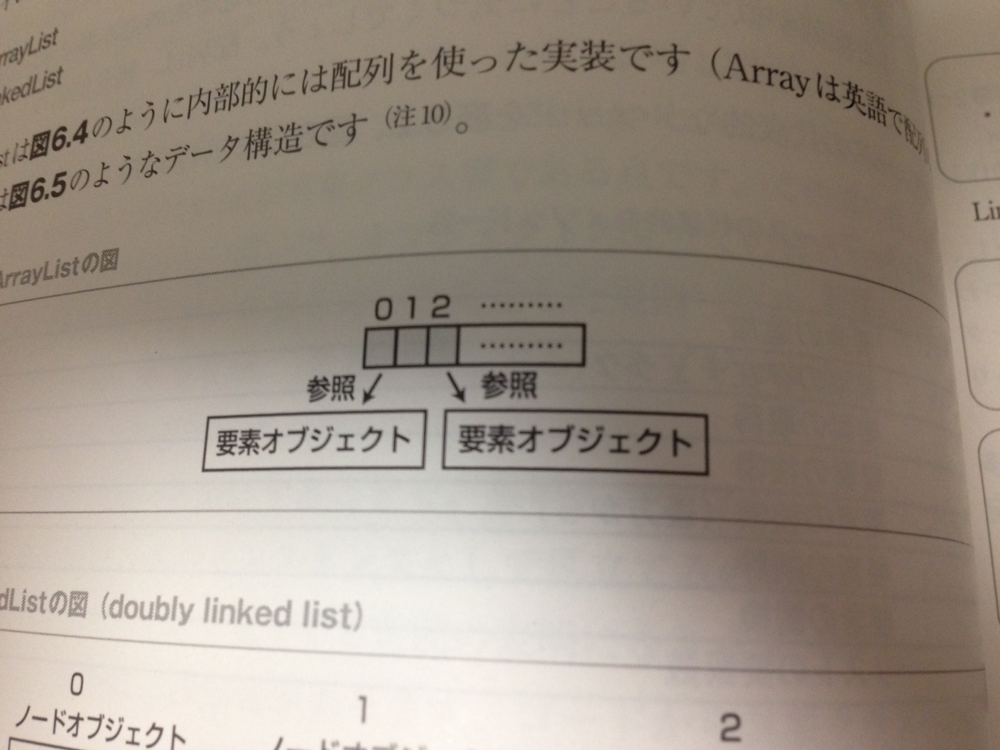
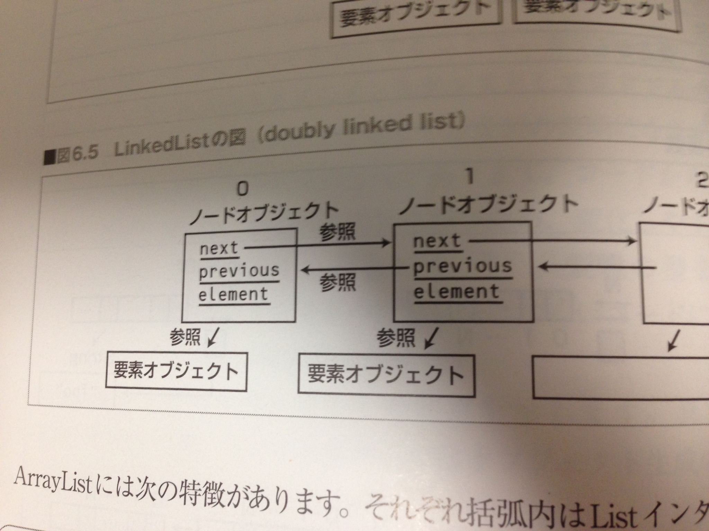
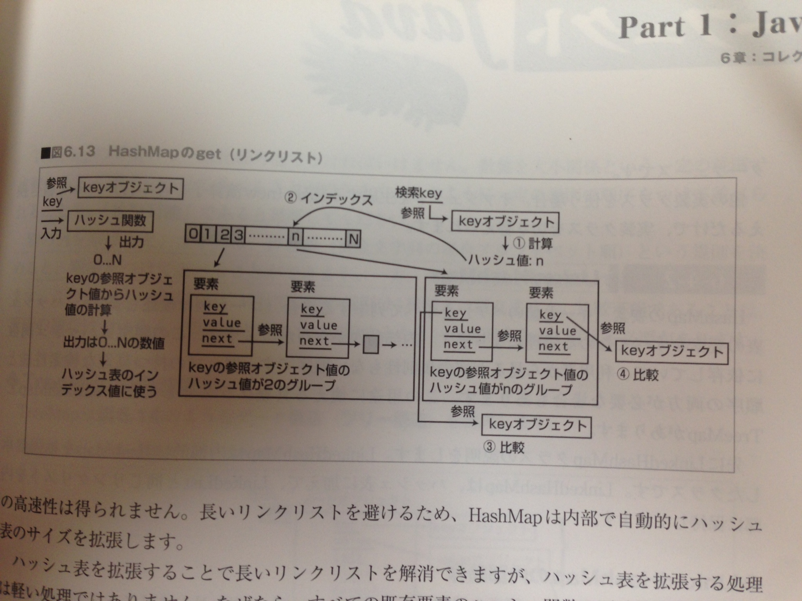
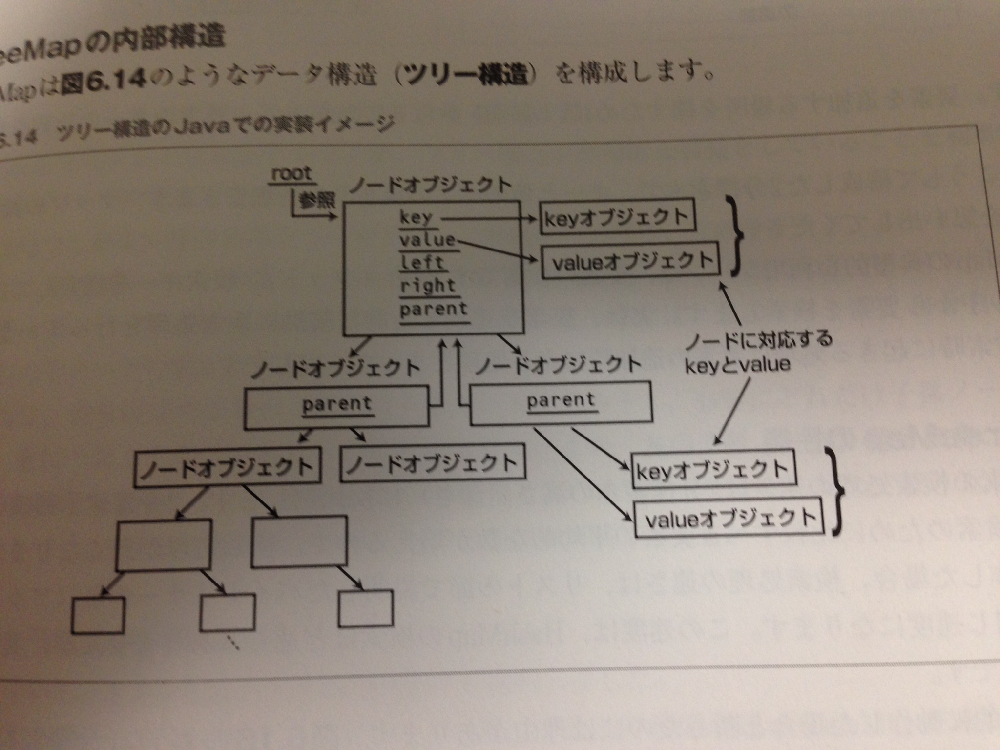

### List

インターフェースのメソッド

* add //要素の追加
* contains //要素の存在確認
* get //要素の取得
* indexOf //要素の検索
* remove //要素の削除
* set //要素の代入
* size //リストの要素数確認

--

大きく２つの実装クラス
* ArrayList
* LinkedList

---

### ArrayList

* インデックスを指定してのget/setが速い
* 先頭からすべての順番を取っていくのが速い。

---

### LinkedList

* 要素の挿入・削除が速い。

---

### sortとsearch

Collectionsクラスに以下のメソッドが用意されている。。

* sort(list, [options])
* binarySearch(list, target, Comparator)

sortしてからbinarySearch（二分探索）すれば探索の効率が良くなる。(O(n) -> O(logn))

---

### Map

メソッド群

* ContainsKey //Keyの存在チェック
* ContainsValue //Valueの存在チェック
* entrySet //要素の集合を取る。
* get //要素の取得
* keySet //Keyの集合を取る。
* put //要素の追加
* remove //要素の削除
* values //Valueの集合を取る。

--

実装クラス

* HashMap
* LinkedHashMap
* TreeMap

---

### HashMap

要素を追加する際に、Keyにhash()をかけて得られた出力値をindexとして配置する。
普通はHash値は被らないはずだが、同じになった場合はLiskedListで追加されていく。

getする際は、同様にKeyにhash()をかけて得られたindexの先にValuesがある。
もし複数の要素があった場合は、順番にKeyでequals()比較を行う。一致したらそのValueを取ってくる。

`new HashMap(initialCapacity)`で初期サイズを定義できる。

*要素の追加・取得はかなり高速だが、hashの再計算が走ると非常に遅くなるため注意が必要。*

---

### LinkedHashMap
HashMapとLinkedListを合わせた感じ。

最後に追加・もしくは参照された値が始めに来るようになっているため、順序も含めて保持しておきたいときに用いる。

欠点として、別でLinkedListも作るため、要素の追加には時間がかかる。

---

### TreeMap
Keyの比較をして、二分木でMapを作成する。

（比較可能（Comparable）を実装していること。）

Keyのsort順に並べたい場合はこれを使うとよいでしょう。

---

### Set

実装メソッド
* add //要素の追加
* contains //要素の存在チェック
* reove //要素の削除
* size //要素の数

実装クラス

* HashSet
* LinkedHashSet
* TreeSet

基本的にはMapと同じ（MapのKeyも一意なのでSetと同じになる。）

### 参考文献

図はすべて[PerfectJava](http://www.amazon.co.jp/%E3%83%91%E3%83%BC%E3%83%95%E3%82%A7%E3%82%AF%E3%83%88Java-PERFECT-SERIES/dp/4774139904/ref=pd_sxp_f_pt)からお借りしました。
