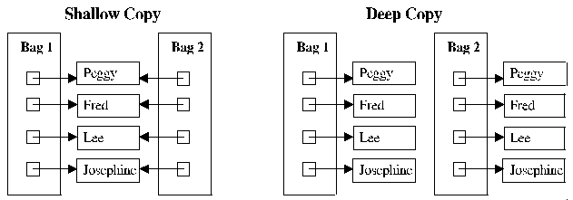

### 8 equalsをオーバーライドする時は一般契約に従う
### 9 equalsをオーバーライドする時は、常にhashCodeをオーバーライドする

#### 理由
オーバーライﾄする理由は後述する。

APIの中には裏でequalsとかを使っているので、実装を間違えるとバグったような動きをする（Setなのに同じ値が入ってしまうとか。）

#### コメント
とりあえず知らなくてもいい。
人が書くと間違えるから、Eclipseさんの自動補完に全てお任せしよう。

--

#### コラム equals()とhashCode()の仕組みと使われる箇所。

一般的に、

- equals()はオブジェクトの値が同じかを比較するメソッド
- hashCode()は同じ値なら同じ結果を、違う値なら違う結果を返すメソッド。

*※同じ値≠同じオブジェクト*

メジャーなところでは、Colection系の実装で呼ばれている。
(例えばSetやMap)

例）

- HashSet どうやって一意性を確保しているのか。
- HashMap Keyを元に、どうやってValueを高速に（*O(1)*）取ってくるのか。

-> **長くなるので聞きに来てくれれば。**

---

### 10 ToStringを常にオーバーライドする

#### 理由
Objectクラスで定義されているものは意味をなさないから。

例

```java
System.out.println(ｐhoneNumber.toString())

//PhoneNumber@163b91 とかが出てくる。

```

知りたいのは電話番号であって、この文字列じゃないよね。

#### コメント
一般には、フィールド変数全てをわかるように返すようにしよう。
これを実装しておくと、System.out.printlnで
そのオブジェクトの中身が全て見えるので便利。

---

### 11 cloneを注意してオーバーライドする

#### 理由
JavaのAPIの設計が悪いため、理解して作るのがちょっと難しい。

Cloneableインターフェースを実装してからCloneをオーバーライドしないとエラーになります。

#### コメント
cloneはDeepcopyが基本だろうと思います。意味がわからないうちはclone()は使わないで下さい。
super.clone()とか、自分の持つフィールド変数に対してclone()する必要があるときは念の為try catchしておこう。

--

#### コラム Deepcopyとは。

- DeepCopyは、コピー対象の中身（フィールド変数）も実体を複製する。

- 一方でshallowCopyは、コピー対象の中身は参照だけ渡す。



by http://learningwithdeepak.blogspot.jp/2012/11/difference-between-shallow-copy-deep.html

---


### 12 Comparableの実装を検討する。

#### 理由
Collection系のsort()に使われるから。

`Collections.sort`とか`SortedList`とか

#### コメント
局所的なsort・分が変更できないクラスへのsort、であるならコンストラクタ作成時に無理やり実装するやり方もあります。

```java

List<Test> list = new ArrayList<Test>();
		list.add(new Test(3,"boo"));
		list.add(new Test(2,"foo"));
		list.add(new Test(4,"woo"));
		list.add(new Test(1,"goo"));
		
		System.out.println(list);
		Collections.sort(list, new Comparator<Test>() {
			public int compare(Test o1, Test o2) {
				return o1.id.compareTo(o2.id);
			}
		});

```

クラスの仕様として定義したいのであればComparableの実装はするべきです。


---

[続く→](chapter4.html)