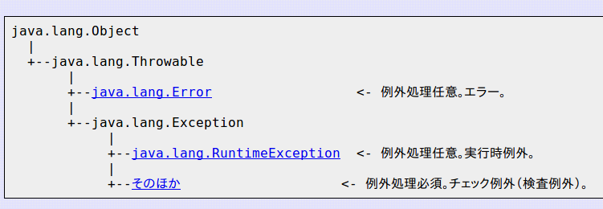

## アジェンダ

* 例外とは
* 実行時例外
* 検査例外
* 使い方

---

## 例外とは

--

### 例外の種類



Errorは無視していいです。（自分で実装する機会があるとは思えないから。）

---

### 実行時例外

java.lang.RuntimeException以下の例外

コンパイル時にひっかからないため、
通常は対処不可能な場合に用いる。

---

### 検査例外

java.lang.Exceptionのうち、Runtimeでないもの。

コンパイル時にひっかかるため、プログラマの方できちんと定義してやる必要がある。

逆に実行時にこれらの例外を気にしなくて良い。
（もう処理が記述されているはずだから。）

---


### 使い方

* 「例外」にだけ例外を用いる
* 回復可能な例外はチェック例外を、それ以外は実行時例外を。
* 例外を全て記述する。
* 詳細メッセージにエラー情報を詰める。
* エラーアトミック性に努める。
* 例外を無視しない
* アサートを使う。


---

### 「例外」にだけ例外を用いる

処理ロジックの中に例外を混ぜると、最適化が行われず実行効率が落ちることが多い。

また、他の例外と区別がつかなくなって読む人が混乱する。

```java
	try {
		int i = 0;
		while(true){
			range[i++].climb();
		}
	} catch (ArrayIndexOutOfBoundsException e) {
	//Nothing
	}

```

`if-else`で代替できるならその方が理解しやすい（JVMも人も）

---

### 回復可能な例外はチェック例外を、それ以外は実行時例外を。

Errorは無視。回復可能だろうと考えるものは、チェック例外にして処理の記述を強制されるべき。

逆に復旧できない例外については、処理を強制されてもどうしようもないので、無視できる実行時例外に流す。

---


### 標準例外
共通な言語を使いたい

---

### 上位例外
メソッドないで何をやっているかに興味はなく、そのメソッドを呼び出して想定される例外を投げる。

```java
void getFromList(int index){
	try{
	//
	} catch (IndexOutOfBoundsException e) {
		throw new NotFoundInListException("Reason");
	} 
}

```

このメソッドだったら、そのindexの場所に値が入ってるかを知りたいので、
IndexがOutかどうかはどうでもいい。

---


### 例外を全て記述する。

実行時例外もJavaDocに書いてあげると、
「あ、このメソッドにこんな値渡すとヤバそうだな」とかが事前にわかる。

メソッドの中身を読まなくても済むようにするのがオブジェクト志向の原則。

---

### 詳細メッセージにエラー情報を詰める。

コンストラクタに入れておくと強制できる。

SampleException.java
```java
public class SampleException extends Exception{
	private static final long serialVersionUID = -9029774938234791120L;
	private final String msg;
	
	SampleException(String msg){
		super(msg);
		this.msg = msg;	
	}

	public String getMsg() {
		return msg;
	}
}
```

Main.java
```java
public static void main(String[] args) {
		try {
			throw new SampleException("Error dayo-");
		} catch (SampleException e) {
			e.printStackTrace();
			System.out.println(e.getMsg());
		}
	}
```

--

こうすると、スタックトレースでもprintlnでも`Error dayo-`が出力されます。

このExceptionはコンストラクタに文字列を強制しているので、呼び出し側へErrorMsgの記述を強制できます。

---

### エラーアトミック性に努める。

エラー後にデータ不整合にならないのが望ましい。

実現方法として、事前にチェックを済ませておくのが良い。**最悪の場合書き戻すことが必要**

※DBとのやりとりはTransactionで制御して、フィールド変数はImmutableならほぼ問題なし。

---

### 例外を無視しない

チェック例外を握りつぶすのは９９％アンチパターン。

きちんとエラー処理をするか、もしどうしても記述できないなら、

- 上に伝播させる
- チェック例外でなく実行時例外になるようにメソッドを修正する。

---

### アサートを使う。

おまけですが、assertというのがあります。
他にも、

- guavaのCheckNotNull()
- lombokの@NotNull

などもあります。

詳しくはググればいいのですが、これらは例外の検知というより、「当然この値だよね」というドキュメントの機能を果たします。


