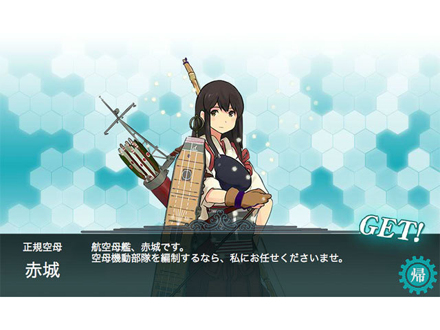
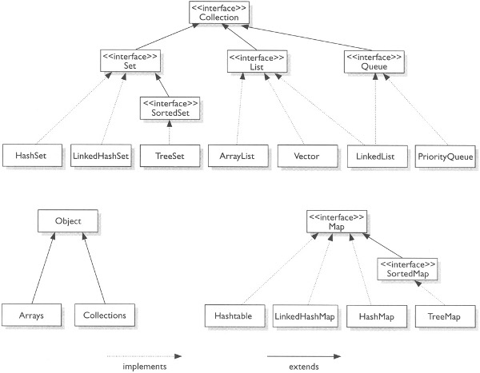

### Collection

> コレクションは、その要素であるオブジェクトのグループを表します。

> [Collection-JavaAPI](http://docs.oracle.com/javase/jp/6/api/index.html?java/util/Collection.html)

どんなメソッドを持ってるべきか考えてみる

> [艦これ](http://www.dmm.com/netgame_s/kancolle/gallery/)

--

### Collectionのメソッド

* add(E e) //要素の追加
* contains(Object o) //要素の存在確認
* isEmpty() //空かどうか
* remove(Object o) //要素の削除
* size() //リストの要素数確認
* toArray() //配列に直す
* iterator() //iteratorを返す。

#### Q

- containsやremoveはどうやって対象のオブジェクトを探してくるの？
- Integer.MaxValue以上の要素をaddしたらどうなるの？

#### Tips

- Itarate中に要素を追加したり削除したりするとErrorになるよ。
- addとかclearとかを実装したくない場合は実行時に`UnsupportedOperationException`を返してね。

--

### 既知のすべての実装クラス:

全ては多すぎますが、Set, List, Deque(Queue)など。

---

### Collections

ユーティリティクラス。
便利メソッドの詰め合わせ。

例えば、

* EMPTY_SET(MAPやLISTも)
	- 空のSetなどを持ってくる。
* sort
	- mergesortする。 O(n log(n)) のパフォーマンス
* binarySearch
	- sortしてから使うと探索の効率が良くなる。 O(n) -> O(log (n))
* reverse shuffle rotate
	- Listの順番を入れ替える。O(n)
* disjoint
	- 共通の要素があるかのチェック
* max (min)
	- 要素の順序付けに従って、指定されたコレクションの最大の要素を返す。

---

どこか良くないところはありますか？

<textarea name="example" cols="50" rows="10" style="font-size:100%;">
memo
</textarea>

---

- [List](list.html)
- [Set](set.html)
- [Map](map.html)
