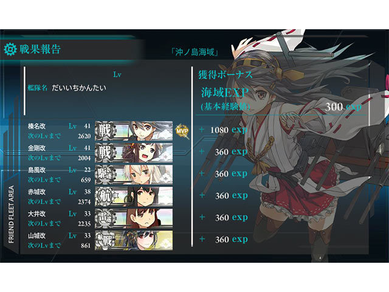
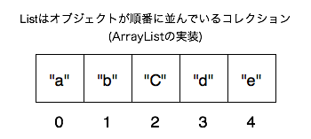
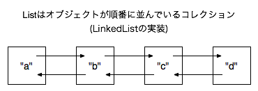

### List

> 順序付けられたコレクションです。シーケンスとも呼ばれます。

> [List-JavaAPI](http://docs.oracle.com/javase/jp/7/api/java/util/List.html)

どんなメソッドを持ってるべきか考えてみる。

> [艦これ](http://www.dmm.com/netgame_s/kancolle/gallery/)

### インターフェースのメソッド

* add(int index, E element) //要素の追加
* get(int index) //要素の取得
* indexOf(E element) //要素の検索
* remove(int index) //要素の削除
* set(int index, E element) //要素の代入

など、要素の順番（index）に対してアクセスする。

#### Q

- indexOfの実装は？

#### Tips

- 順番を入れ替える系はCollectionsに入っている

> List インタフェースは、iterator、add、remove、equals、および hashCode の各メソッドの規約に対して、Collection インタフェースで指定されているものに加えてさらに条項を追加します。便宜上、ほかの継承メソッドの宣言もここに含まれます。

--

### 既知のすべての実装クラス:

* AbstractList // Listのスケルトン実装（RandamAccsess）
* AbstractSequentialList // Listのスケルトン実装（Sequential）
* ArrayList // ド定番
* AttributeList // ggrenaiks
* CopyOnWriteArrayList // 同期させたい時などに役立つ(?)
* LinkedList // List + Deque
* RoleList // ggrenaiks
* RoleUnresolvedList // ggrenaiks
* Stack // LIFO(Dequeで良くない？)
* Vector // スレッドセーフなArrayList。過去の遺産

**※ggrenaiks -> ググっても出ないks**

#### Q

- スケルトン実装って？
- スレッドセーフな実装って？

---

### ArrayList

配列に並べたList。

#### Feature

* インデックスを指定してのget/setが速い
* 先頭からすべての順番を取っていくのが速い。

#### Implement

[ArrayList(JDK1.7_60)](./ArrayList.java)

---

### LinkedList

nodeで並べたList。

#### Feature

* 要素のadd/removeが速い。

#### Implement

[LinkedList(JDK1.7_60)](./LinkedList.java)

---

### sortとsearch

Collectionsクラスに以下のメソッドが用意されている。。

* sort(list, [options])
* binarySearch(list, target, Comparator)

sortしてからbinarySearch（二分探索）すれば探索の効率が良くなる。(O(n) -> O(logn))

---
