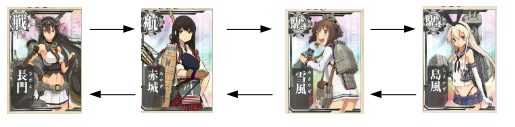

## List

> 順序付けられたコレクションです。シーケンスとも呼ばれます。
[JavaAPI](http://docs.oracle.com/javase/jp/7/api/java/util/List.html)


> [艦隊List](http://www.dmm.com/netgame_s/kancolle/gallery/)

--

## どんなメソッドを持ってるべき？


### Response

* 何番目の値が欲しい、とか
* 最後に入れたやつを取りたいとか

--

## インターフェースのメソッド

* add(int index, E element) //要素の追加
* get(int index) //要素の取得
* indexOf(E element) //要素の検索
* remove(int index) //要素の削除
* set(int index, E element) //要素の代入
* toArray(T[] a) //配列を返す

など、要素の順番（index）に対してアクセスする。

--

### Q

* indexOfの実装は？

### Tips

* 順番を入れ替える系はCollections, Arraysに入っている
	- 例えば、`sort`の実装を読んでみるとわかる

--

ListのAPIにこんな記述が。

> List インタフェースは、iterator、add、remove、equals、および hashCode の各メソッドの規約に対して、Collection インタフェースで指定されているものに加えてさらに条項を追加します。便宜上、ほかの継承メソッドの宣言もここに含まれます。

### Q

* どういう意味？

--

## 既知のすべての実装クラス:

* AbstractList // Listのスケルトン実装（RandamAccsess）
* AbstractSequentialList // Listのスケルトン実装（Sequential）
* ArrayList // 定番
* CopyOnWriteArrayList // 同期させたい時などに役立つ(?)
* LinkedList // List + Deque
* RoleList・RoleUnresolvedList・AttributeList // 誰？
* Stack // LIFO(Dequeで良くない？)
* Vector // スレッドセーフなArrayList。過去の遺産

--

### Q

- スケルトン実装って？
- スレッドセーフな実装って？
- SortedListがないのは何で？

### Tips

* `AbstractList`の中を見ると、`add`などが`UnsupportedOperationException`を返している。
	- 実装クラスでオーバーライドしないと実行時例外に
	- 後付けなんだろうなぁ。。。

---

## Arrays

> このクラスには、ソートや検索など、配列を操作するためのさまざまなメソッドがあります。また、配列をリストとして表示するための static ファクトリもあります。
[JavaAPI](http://docs.oracle.com/javase/jp/7/api/java/util/Arrays.html) -  [Web(openjdk-7)](http://www.docjar.com/html/api/java/util/Arrays.java.html) - [Row(JDK1.7_60)](./Arrays.java)

--

## Arraysのメソッド

- asList(T... a)
	* 指定された配列に連動する固定サイズのリストを返します。
- binarySearch(Object[] a, Object key)
	* Collectionsのメソッドはこれを呼び出します。
- copyOf(T[] original, int newLength)

他は全て配列への操作なのに、asListだけListを返します。
これは`Collections`とかが持つべき処理だと思う。


--

### Tips

* 今や使うとしたらasListくらい？これには落とし穴が。。。
	- 実装を読むと、内部クラスにArrayListというクラス名が。。。
* Collectionsクラスは中でArraysを呼んでたりする。(sortとか)

---

## ArrayList

> List インタフェースのサイズ変更可能な配列の実装です。
[JavaAPI](http://docs.oracle.com/javase/jp/7/api/java/util/ArrayList.html) -  [Web(openjdk-7)](http://www.docjar.com/html/api/java/util/ArrayList.java.html) - [Row(JDK1.7_60)](./ArrayList.java)


--

### Feature

* インデックスを指定してのget/setが速い

### Q

* add, remove, get, setのオーダーは？
* Capacityの取り扱いは？

--

## Implement

```java
private transient Object[] elementData;

...

public E get(int index) {
        rangeCheck(index);

        return elementData(index);
    }

...

@SuppressWarnings("unchecked")
	E elementData(int index) {
		return (E) elementData[index];
	}

```

内部でelementDataというオブジェクトの配列を持っている。

---

## LinkedList

> List および Deque インタフェースの二重リンクリスト実装です。
[JavaAPI](http://docs.oracle.com/javase/jp/7/api/java/util/LinkedList.html) - [Web(openjdk-7)](http://www.docjar.com/html/api/java/util/LinkedList.java.html) - [Row(JDK1.7_60)](./LinkedList.java)



--

### Feature

* 要素のadd/removeが速い。

### Q

* add, remove, get, setのオーダーは？
* Dequeって何？

--

## Implement

```java

public class LinkedList<E>
	extends AbstractSequentialList<E>
	implements List<E>, Deque<E>, Cloneable, java.io.Serializable
	{

	transient Node<E> first;

	transient Node<E> last;

...

	public E get(int index) {
		checkElementIndex(index);
		return node(index).item;
	}

...

	Node<E> node(int index) {
        // assert isElementIndex(index);

        if (index < (size >> 1)) {
            Node<E> x = first;
            for (int i = 0; i < index; i++)
                x = x.next;
            return x;
        } else {
            Node<E> x = last;
            for (int i = size - 1; i > index; i--)
                x = x.prev;
            return x;
        }
    }

```

内部でNodeを辿ってる。

--

### LinkedListはいらない子？

* 途中の要素にadd removeする機会はほとんどない
* Nodeを持つためメモリ消費が多い。

ということで、Listとして使うことはほとんどないのではと。


---

### sortとsearch

Collectionsクラスに以下のメソッドが用意されている

* sort(list, [options])
* binarySearch(list, target, Comparator)

`binarySearch`すれば探索が(O(n) -> O(logn))になる。

が、`sort`に(O(n logn)かかる。

### 使いどき

* 何度も同じListをsearchする
	- `sort`してから`binarySearch`。
* Listに頻繁にadd removeする
	- 毎回`find`したほうが速いかも。

---

## Any Question?


> [livedoor.blogimg.jp](http://livedoor.4.blogimg.jp/chihhylove/imgs/6/f/6f0e791f.jpg)

---

## Reference

- [艦これ](http://www.dmm.com/netgame_s/kancolle/)
