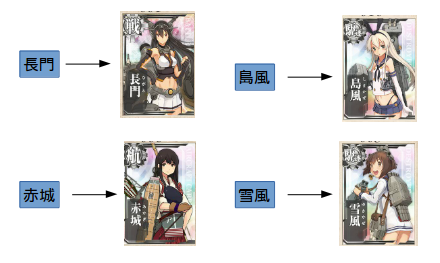

準備中

---

## Map

> キーを値にマッピングするオブジェクトです。...インタフェースというよりむしろ完全に抽象クラスであった Dictionary クラスに代わるものです。
[JavaAPI](http://docs.oracle.com/javase/jp/7/api/java/util/Map.html)

> [艦隊Map](http://www.dmm.com/netgame_s/kancolle/gallery/)

--

## どんなメソッドを持ってるべき？

--

## インターフェースのメソッド

* put(K key, V value) // 要素の追加
* get(Object key) // 要素の取得
* remove(Object key) // 要素の削除
* entrySet() // マッピングのSetを返す

など、Keyを引数にしてValueに処理をするメソッドが多い。

--

#### Q
* get, removeはなぜObjectで受けてるの？
* Map.Entryというクラスがある？

--

## 既知のすべての実装クラス

数が多いので省略して。

* AbstractMap //Mapのスケルトン実装
* ConcurrentHashMap // 同期化されたHashMap
* ConcurrentSkipListMap // 同期化されたSort済みのMap
* EnumMap // Enum用の軽量Map
* HashMap // Hash値で管理するMap
* Hashtable // 性能でHashMapに劣る？
* IdentityHashMap // Keyの比較が、同値でなく同一の場合とするMap
* LinkedHashMap // HashMapをextendsしてLinkをつけたMap
* TreeMap // SortedMapを実装したMap

---

### SortedMap

> そのキーに対して全体順序付けを提供する Map です。マップの順序付けは、キーの自然順序付けに従って行われるか、ソートマップ構築時に通常提供される Comparator を使って行われます。[JavaAPI](http://docs.oracle.com/javase/jp/7/api/java/util/SortedMap.html)

--

### どんなメソッドを持ってるべき？

--

## インターフェースのメソッド

* comparator() // 要素の追加
* firstKey() // Map内の最初のKeyを返す
* headMap(K toKey) // toKeyよりも小さいキーを持つ部分のMapを返す。
* lastKey() // Map内の最後のKeyを返す
* tailMap(K fromKey) // fromKeyよりも大きいキーを持つ部分のMapを返す。

など、順番を元にした処理を行う。

--

### 既知のすべての実装クラス:

* ConcurrentSkipListMap
* TreeMap

--

### HashMap

> Map インタフェースのハッシュテーブルに基づく実装です。
[JavaAPI](http://docs.oracle.com/javase/jp/7/api/java/util/HashMap.html) -  [Web(openjdk-7)](http://www.docjar.com/html/api/java/util/HashMap.java.html) - [Row(JDK1.7_60)](./HashMap.java)

--

### Feature

要素を追加する際に、Keyにhash()をかけて得られた出力値をindexとして配置する。
普通はHash値は被らないはずだが、同じになった場合はLiskedListで追加されていく。

getする際は、同様にKeyにhash()をかけて得られたindexの先にValuesがある。
もし複数の要素があった場合は、順番にKeyでequals()比較を行う。一致したらそのValueを取ってくる。

`new HashMap(initialCapacity)`で初期サイズを定義できる。

*要素の追加・取得はかなり高速だが、hashの再計算が走ると非常に遅くなるため注意が必要。*

--

#### Q

* get, put のオーダーは？

#### Tips

--

### Implement

---

### LinkedHashMap
> 予測可能な反復順序を持つ Map インタフェースのハッシュテーブルとリンクリストの実装です。
[JavaAPI](http://docs.oracle.com/javase/jp/7/api/java/util/LinkedHashMap.html) -  [Web(openjdk-7)](http://www.docjar.com/html/api/java/util/LinkedHashMap.java.html) - [Row(JDK1.7_60)](./LinkedHashMap.java)

最後に追加・もしくは参照された値が始めに来るようになっているため、順序も含めて保持しておきたいときに用いる。

欠点として、別でLinkedListも作るため、要素の追加には時間がかかる。

---

### TreeMap
Keyの比較をして、二分木でMapを作成する。

（比較可能（Comparable）を実装していること。）

Keyのsort順に並べたい場合はこれを使うとよいでしょう。

---

仕組み紹介。
キーの完全一致、

---

## Any Question?

> [かる日記](http://karu.blog.so-net.ne.jp/2010-08-24)

---

## Reference

- [艦これ](http://www.dmm.com/netgame_s/kancolle/)
