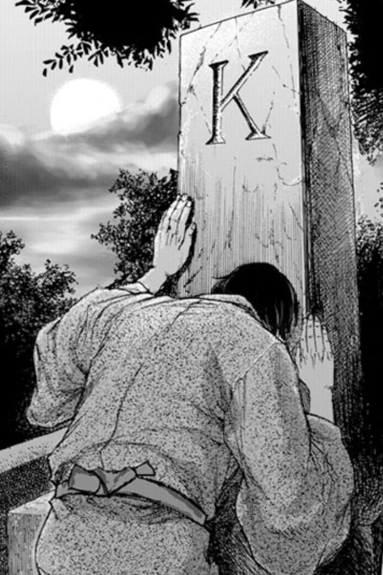

準備中

---

## Set

> 重複要素のないコレクションです。...数学で言う集合の抽象化をモデル化します。
[JavaAPI](http://docs.oracle.com/javase/jp/7/api/java/util/Set.html)


> [艦隊Set](http://www.dmm.com/netgame_s/kancolle/gallery/)

--

## どんなメソッドを持ってるべき？


### Response

* Collectionと同じじゃない？
* 既にあるかの判定？

--

## インターフェースのメソッド

* containsAll(Collection<?> c) //入力のコレクションの全要素が含まれているか？
* retainAll(Collection<?> c) //入力のコレクション内にある要素だけを保持する
* add(E e) //要素の追加（重複しない場合に限る）

など、Collectionとほぼ同じ。

--

## 既知のすべての実装クラス

* AbstractSet //Set インタフェースのスケルトン実装
* ConcurrentSkipListSet //同期の際に使える（？）順序付きSet
* CopyOnWriteArraySet //内部でCopyOnWriteArrayListを持つSet
* EnumSet //Enum用の軽量Set
* HashSet //Hash値でもって管理するもの
* JobStateReasons //Set?
* LinkedHashSet //HashSetに順序がついたもの
* TreeSet //SortされたSet

基本的にはMapと同じ（MapのKeyも一意なのでSetと同じになる。）

--

#### Q

#### Tips


---

## HashSet

> このクラスは、ハッシュテーブル (実際には HashMap のインスタンス) に連動し、Set インタフェースを実装します。このクラスでは、セットの反復順序について保証しません。
[JavaAPI](http://docs.oracle.com/javase/jp/7/api/java/util/HashSet.html) -  [Web(openjdk-7)](http://www.docjar.com/html/api/java/util/HashSet.java.html) - [Row(JDK1.7_60)](./HashSet.java)


--

### Feature

内部でHashMap<E, Object>を使ってる。
特筆することはないかな。


--

### Q

### Tips


--

## Implementation

```java
private transient Object[] elementData;

...

public E get(int index) {
        rangeCheck(index);

        return elementData(index);
    }

...

@SuppressWarnings("unchecked")
	E elementData(int index) {
		return (E) elementData[index];
	}

```

内部でelementDataというオブジェクトの配列を持っている。

---

## LinkedHashSet
> 予測可能な反復順序を持つ Set インタフェースのハッシュテーブルとリンクリストの実装です。
[JavaAPI](http://docs.oracle.com/javase/jp/7/api/java/util/LinkedHashSet.html) -  [Web(openjdk-7)](http://www.docjar.com/html/api/java/util/LinkedHashSet.java.html) - [Row(JDK1.7_60)](./LinkedHashSet.java)

--

## Feature

最後に追加・もしくは参照された値が始めに来るようになっているため、順序も含めて保持しておきたいときに用いる。

欠点として、別でLinkedListも作るため、要素の追加には時間がかかる。

--

### Q

* むしろ質問ある？

### Tips

* むしろTips教えて。

---

### TreeSet
> TreeMap に基づく NavigableSet 実装です。
[JavaAPI](http://docs.oracle.com/javase/jp/7/api/java/util/TreeSet.html) -  [Web(openjdk-7)](http://www.docjar.com/html/api/java/util/TreeSet.java.html) - [Row(JDK1.7_60)](./TreeSet.java)


--

## Feature

要素Eが順序付けされた赤黒木が作成される。
（比較可能（Comparable）を実装していること。）

Iterator（拡張for）で回すとsortされた結果が得られる。
**SortedListでなくこちらを使うべき**

--

### Q

* 同値のオブジェクトが入ってきた場合は？
* 

### Tips


---


---

## Any Question?



> 「精神的に向上心のない者はばかだ」 - 夏目漱石『こころ』

> [livedoor.blogimg.jp/fknews](http://livedoor.blogimg.jp/fknews/imgs/3/1/31c9310b.jpg)

---

## Reference

- [艦これ](http://www.dmm.com/netgame_s/kancolle/)
