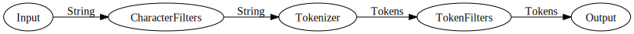

## Index

* Elasticsearchとは？
* 全文検索の仕組み
* Analyzer
* 概念・単語
* サンプル

--

## Elasticsearchとは？

Apache v2ライセンスで公開されているオープンソースソフトウェアであり、全文検索エンジンであるLuceneを使用した、全文検索システムです。

特徴として

* RESTfulなAPIが使える
* InputもOutputもJSON
* スキーマレスで面倒な定義無しにデータを登録可能

等があります。

from: http://dev.classmethod.jp/cloud/aws/use-elasticsearch-1-use-kuromoji/

-

### 何が嬉しいのか？

* Nodeを複数立てることでスケールアウト可能
* インクリメンタルサーチ
* 集計系のクエリが扱える
* ネストしたデータ構造を扱える
* 日本語の形態素解析ソフト「Kuromoji」が使える
* Kibanaというデータのグラフィカルツールが使える

etc...

-

## どんな用途に向いてる？

* 大量データの全文検索（複数Nodeで分散処理できる・精度が高い）
* あいまい検索・サジェストなどのリッチな検索全般
* ログ統計（Kibana）

-

## できないこと

* Transactionの管理（rollbackなどの仕組み）
* joinなど、複数データ構造の合成

（あくまで検索専用というのが無難か）

--

## 全文検索の仕組み

* データの登録
	- 文字列→Analyzer→格納

* データの検索
	- 検索文字列→Analyzer→一致するtermを取得

--

## Analyzer

構文解析（analyze）は、文字列を意味のある単位（term）に分割する。

文字列ストリーム（入力）→事前フィルタリング（Character filters）→単語に分割（Tokenizer）→事後処理（TokenFilter）→保存（or検索）

という流れで処理される。

https://www.found.no/foundation/text-analysis-part-1/

### Q

形態素解析ソフトの比較？（MeCab・ChaSen他）

-

