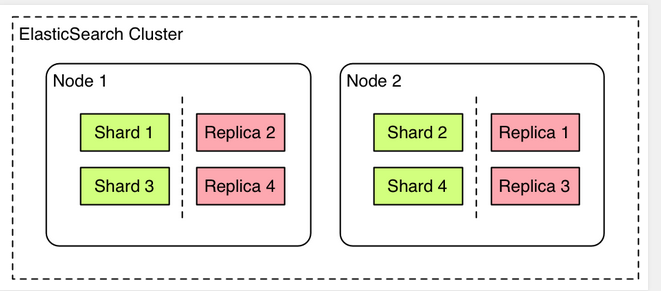
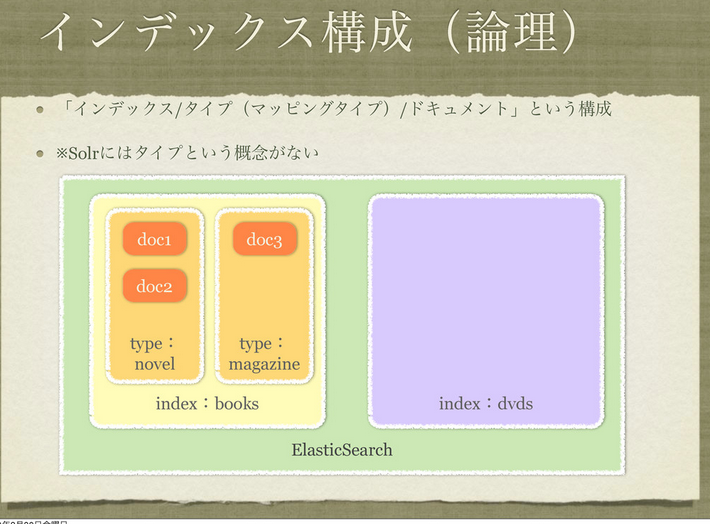
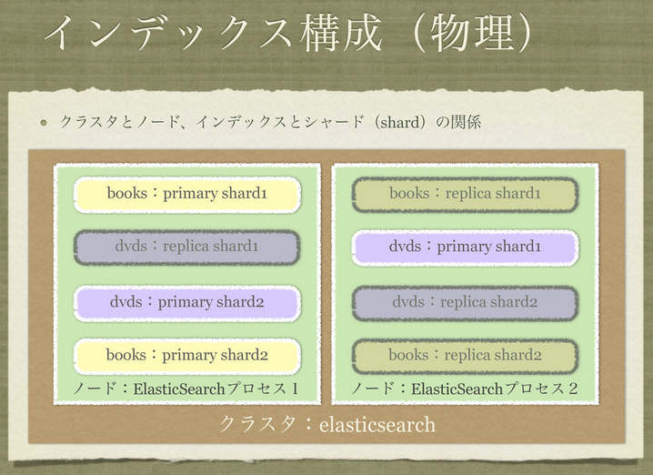

## Index

* Elasticsearchとは？
* 全文検索の仕組み
* 概念・単語
* 検索サンプル
* JavaAPI

動作確認は[こちらで](https://github.com/uryyyyyyy/elasticsearchSample)

---

## Elasticsearchとは？

全文検索エンジンであるLuceneを使用した全文検索システム。

特徴として

* RESTfulなAPIが使える
* InputもOutputもJSON
* スキーマフリーなので面倒な定義無しにデータを登録可能

等があります。

http://dev.classmethod.jp/cloud/aws/use-elasticsearch-1-use-kuromoji/

--

### 何が嬉しいのか？

* Nodeを複数立てることでスケールアウト可能
* autocomplete・あいまい検索
* 集計系のクエリが扱える
* ネストしたデータ構造を扱える
* 日本語の形態素解析ソフト「Kuromoji」が使える
* Kibanaというデータのグラフィカルツールが使える

etc...

--

### どんな用途に向いてる？

* 大量データの全文検索（複数Nodeで分散処理できる・精度が高い）
* あいまい検索・サジェストなどのリッチな検索全般
* ログ統計（Kibana）

--

### できないこと

* Transactionの管理（rollbackなどの仕組み）
* joinなど、複数データ構造の合成

　

（あくまで検索専用というのが無難かと）

---

## 全文検索の仕組み

* データの登録
	- 文字列→構文解析→保存

* データの検索
	- 検索文字列→構文解析→保存された中から一致するtermを取得

https://github.com/uryyyyyyy/elasticsearchSample/blob/master/doc/analysis.md

--

## 構文解析

構文解析（analyze）は、文字列を意味のある単位（term）に分割する。

* 文字列ストリーム（Imput）
* 事前フィルタリング（Character filters）
* 単語に分割（Tokenizer）
* 事後処理（TokenFilter）
* 保存 or 検索(Output)

という流れで処理される。

https://www.found.no/foundation/text-analysis-part-1/

--

### analyzer

analyzerは、文字列の分割方法を定義するtokenizerと、分割後の文字列の整形処理を定義するfilterによって構成されます。

例えば、tokenizerがngramで文字列を分割し、filterで大文字小文字を小文字に統一してしまうなどといった定義をすることが出来ます。

analyzerはいくつでも定義することが出来、Field毎にどのanalyzerを利用するか決めることが出来ます。

http://engineer.wantedly.com/2014/02/25/elasticsearch-at-wantedly-1.html

--

### Example

https://www.found.no/foundation/text-analysis-part-1/

--

### kuromoji

日本語の形態素解析ソフト。

elasticsearch向けにAnalyzerやtokenizerを提供しているみたい。

[動作チェック](https://github.com/uryyyyyyy/elasticsearchSample/tree/master/script/kuromoji)

--

## Analyzerの使い分け

(※あくまで一般論です。独自で定義することも可能です)

* 部分一致・あいまいでもHitさせたい
	- Titleやお店の名前など
	- NgramAnalyzer

* 検索ワードとしてふさわしくないものを除外したい。
	- 前置詞、助詞、その他（the, a etc...）を省く
	- stopAnalyzer

* 日本語として検索したい
	- 日本語は単語の切れ目がわかりにくいので専用のAnalyzerが必要
	- KuromojiAnalyzer

--

### Q

形態素解析ソフトの比較？（MeCab・ChaSen他）

---

## 概念・単語

--

## Cluster

耐障害性・スケーリングの観点から、複数のサーバ間で協調して動作させることができる。

それらのサーバ群のことをClusterと呼ぶ。

スケーリングには大きく、

* Replica
* Sharding

の二種類がある。

デフォルトではelasticsearchというClusterが立ち上がる。node名はランダム。

変更したい場合は起動オプションか設定ファイルを編集。

`./elasticsearch --cluster.name my_cluster_name --node.name my_node_name`

--

## Node

（一般的なNodeとほぼ同意）

Cluster内にある個々のサーバを指す。

RDBで言うDBサーバに相当。

--

## Shard

ドキュメントを複数のサーバに分散させること。

これによって一台のマシンではスペックが足りないデータ量・高負荷も処理できる。

elasticsearchは、クライアント側がシャードを意識しなくても使えるように隠蔽している。

RDBのシャードに相当

--

## Replica

PrimaryNodeの完全なコピーをする。
これによって並列処理・バックアップが可能になる。

PrimaryNodeが死んだ場合、クラスタはReplicaから新しいPrimaryNodeを選ぶ。

--

## 図解

Sharding & replica

http://blog.liip.ch/archive/2013/07/19/on-elasticsearch-performance.html

--

### Q

どの範囲でclusterとして振る舞うの？同じLan内？

→デフォルトだとMultiCastで探すらしい。（AWS内ではこれが使えないので別の方法を使うのだとか。）

--

## Index

データ群の集合。

RDBでいうスキーマに相当。

--

## Type

データ（Document）を保存する場所の単位。

RDBでいうテーブルに相当。

--

## Document

実際に格納されるデータの単位。

Documentの中にはIdや、Typeを持ったデータが含まれる。

RDBで言うテーブルのレコードに相当。

--

### Field

ドキュメント内に含まれるデータの一つ。

Data Typeと値を持つ。

RDBのカラムに相当。

--

## 図解

http://sssslide.com/speakerdeck.com/johtani/elasticsearchru-men

--

## 図解２

http://sssslide.com/speakerdeck.com/johtani/elasticsearchru-men

--

### Q

IndexとTypeってどう違うの？スキーマとかないんじゃない？

→使用者が扱う論理単位がType・管理者が扱う物理単位がIndexじゃないかな？（曖昧）

---

## 検索サンプル

検索には大きく３種類ある。

* Query
* Filter
* Aggregation

--

### Query

スタンダードな検索

* 部分一致
* スコアリング（検索の重み付け）
* 検索文字列のAnalyzerの指定
* 複数のクエリの論理和・論理積
* 数値への範囲指定

--

### Filter

やってることは簡易Queryと思えばいい。
特徴として、

* Scoreされないから速い。
* Cacheが効く。

用途としては、先にFilterでデータ群を用意しておくことでQueryの処理を効率化する。

（OracleDBでいうマテリアルビューみたいなものかな）

--

### Aggregation

集計系を扱うクエリ

RDBでいうcountやaverageなどを担う。

---

## JavaAPI

もちろん、Http経由でなくJavaAPIから直接叩くこともできる。

（まだ書いてないので[こちらを参照](https://github.com/uryyyyyyy/elasticsearchSample/tree/master/JavaAPI)）

---

## 疑問

* RDBとの連携は？
* データの整合性・一貫性は？
* 他の全文検索システムは？比較は？
