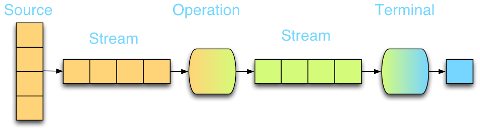
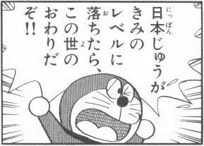

## StreamAPI

> 順次および並列の集約操作をサポートする要素のシーケンスです。
[JavaAPI](http://docs.oracle.com/javase/jp/8/api/java/util/stream/Stream.html)



> [1st8](http://www.first8.nl/presentations/java8/#/3/1)

（primitive型用のIntStreamなどもありますが、まぁ同じものです。）

--

> Streamの値の持ち方はjava.util.Listのようなイメージ。

> * なお、Streamはコレクションフレームワーク（List・Queue・Set・MapやCollectionsクラス等）の一員ではない。
> * また、java.io.InputStreamやjava.io.OutputStreamやPrintStream等とは（名前が似ている以外の）何の関係も無い。

> [hishidama](http://www.ne.jp/asahi/hishidama/home/tech/java/stream.html)

--

## ラムダ式

関数型インターフェースを実装した無名クラスの宣言のsyntax-sugar

（厳密には、より最適化されるらしい。→[@IT](http://www.atmarkit.co.jp/ait/articles/1403/17/news105_2.html), [社内Java8勉強会 by池添さん](http://www.slideshare.net/zoetrope/java8-lambdaandstream)）

簡単に書けるし効率良いので、とりあえずラムダ式使うべし。

```java

Predicate<String> p = new Predicate<String>(){
	@override
	public boolean test(String s){
		return s.isEmpty();
	}
}

Predicate<String> p = s -> s.isEmpty();

```

--

## 何が嬉しいの？

処理を宣言的に（簡単に）書けるため、

* 最適化（並列化）しやすい。
	- （内部で勝手にやってくれる）
* バグりにくい
* 読みやすい
* 書くのが楽

などの利点がある。

--

## 目次

* 関数型インターフェース
	- Predicate
	- Function
	- Supplier etc...
* streamクラスのメソッド
	- map
	- filter
	- flatMap
	- forEach etc...
* Collect処理
	- groupingBy
	- toList etc...

---

## 関数型インターフェース

メソッド定義をひとつだけ持ったインターフェース。
ラムダ式やメソッド参照の代入先になる。

Javaだと関数が単体で（オブジェクトとして）存在できないため、
メソッドを一つだけ持ったクラスで対応している。

**@FunctionalInterface**がついてるハズ。

java.util.function以下にたくさん入ってる。

--

## Supplier

値を返す（供給する）関数。
引数なしで何らかの値を返す。

[source(JDK1.8_11)](./Supplier.java)

```java

Supplier<String> s = () -> "abc";

```

--

## Consumer

引数を受け取り、それを使って処理を行う関数。
値を返さないで副作用を起こす。

[source(JDK1.8_11)](./Consumer.java)

```java

Consumer<String> c = s -> System.out.println(s);

```

引数を２つ受け取る`BiConsumer`もある。

--

## Predicate

引数の判定を行う関数。
判定結果をbooleanで返す。

[source(JDK1.8_11)](./Predicate.java)

```java

Predicate<String> p = s -> s.isEmpty();

```

--

## Function

値を変換する関数。
引数を別の値に変換して返す。

[source(JDK1.8_11)](./Function.java)

```java

Function<String, File> f = s -> new File("/tmp", s);

```

--

## UnaryOperator

単項演算子を表す関数。
引数に演算を行い、同じ型の値を返す。（特殊なFunction）

[source(JDK1.8_11)](./UnaryOperator.java)

```java

UnaryOperator<String> op = s -> s.toUpperCase();

```

--

## BinaryOperator

二項演算子を表す関数。
同じ型の2つの引数を受け取り、同じ型の値を返す。

[source(JDK1.8_11)](./BinaryOperator.java)

```java

BinaryOperator<String> op = (s1, s2) -> s1 + s2;

```

--

### Tips

昔からあるComparatorにも@FunctionalInterfaceがついてる。

[source(JDK1.8_11)](./Comparator.java)

### Q

* 覚えるだけだと思う。


---

## streamクラスのメソッド

全体が知りたければココを読むべし。これだけで十分。

[hishidama](http://www.ne.jp/asahi/hishidama/home/tech/java/stream.html)

ひと通り調べてみる。

マルチコア時代になり、プログラムの方でも並列化できるように書く必要性が出てきたのでは。
（特に、一台のスーパーマシンでなく複数のサーバーで平行稼働させたい場合など。）

--


--


---

## Collect処理

[Collectorを征す者はStream APIを征す（部分的に）](http://blog.exoego.net/2013/12/control-collector-to-rule-stream-api.html)

なぜ必要か。

関数型であれば標準でできることが、Javaだとできない（最適化されず遅い）ので、
ここの中で上手いことやってくれる（実装は知らなくてもいい）。


--

## collect

末端処理（Streamから普通のオブジェクトに戻す処理）を行う。

`Stream#collect(Supplier<R> supplier, BiConsumer<R,? super T> accumulator, BiConsumer<R,R> combiner) <R> R`

SupplierもBiConsumerも既に登場しましたよね。返り値は`<R>`のようです。

中の処理は、Supplierで作られた`<R>`のインスタンスに、Streamから来た要素`<T>`を
accumulatorで処理していくようです。

（たぶん並行処理したいときに`combiner`で、あるスレッドで作られた`<R>`と、別のスレッドで作られた`<R>`を合成している。）

--

## 例

```java

	List<String> list = Stream.of("a", "b", "c").collect(
				() -> new ArrayList<>(10), 
				(l, t) -> l.add(t), 
				(l1, l2) -> l1.addAll(l2));
	System.out.println(list); 
	//a
	//b
	//c

```

supplierでインスタンス(`List<String>`）に、Streamから来た要素(String)をAccumulatorで処理（(l, t)のlがList, tが要素。返り値はないがlistに蓄積）している。

もしListが複数できちゃったら、combinerでまとめる。

--

## Collectors

> 要素をコレクションに蓄積したり、さまざまな条件に従って要素を要約するなど、有用な各種リダクション操作を実装したCollector実装。

> [JavaSE8-API](http://docs.oracle.com/javase/jp/8/api/java/util/stream/Collectors.html)

[使い方](http://www.ne.jp/asahi/hishidama/home/tech/java/collector.html)

--

### 汎用メソッド

counting()
→入力要素の数をカウントする

groupingBy(Function<? super T,? extends K> classifier)
-> classifierの結果が同じものをgroup化したMapを返す。追加処理も書けるよ。

joining()
→ 流れてきた要素を全てStringで連結して一つにする。

ToCollection(Supplier<C> collectionFactory)
→ StreamをCollectionに変換する（toList, toMapなどもある。）

--

## その他

（代替できるので覚えなくていいかも。
最適化されてるっぽいので、どうしても遅いなら検討する程度で。）

collectingAndThen → Stream#collect()・Function。

summingLong → Stream#mapToLong()・LongStream#sum()

summarizingLong() → Stream#mapToLong()・LongStream#summaryStatistics()

maxBy() → Stream#max()

reducing() → Stream#reduce()


---

その他

無限リスト・遅延評価


---

## Any Question?



> [http://livedoor.4.blogimg.jp/](http://livedoor.4.blogimg.jp/chihhylove/imgs/6/f/6f0e791f.jpg)

---
