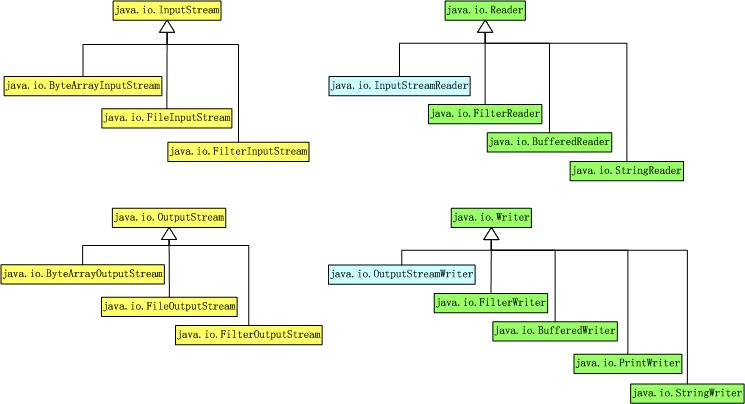

## Streamとは？

データを読み書きできる性質、を抜き取ったもの。
ファイルだけでなく、ネットワーク、メモリアクセスなど、データの流れは何でも取り扱えるよう抽象化されている。

（詳しくないけど、Java8のStreamAPIとは別物？）

---

## 種類

#### 抽象基底クラス

|  | 入力ストリーム | 出力ストリーム |
|:-----------|------------:|:------------:|
| バイト単位 | InputStream | OutputStream |
| 文字列単位 | Reader | Writer |




> via http://blog.csdn.net/sfdev/article/details/3771134

---

## Fileを読み込む場合

流れとして、

FileのPath、名称を取得する

そのFileが存在するか確認する。（isExist）

Fileが読み込み可能か確認する(isFile, canRead)


```java
try{
  File file = new File("c:¥¥tmp¥¥test.txt");
  FileReader filereader = new FileReader(file);

  int ch = filereader.read();
  while(ch != -1){
    System.out.print((char)ch);

    ch = filereader.read();
  }
}catch(FileNotFoundException e){
  System.out.println(e);
}catch(IOException e){
  System.out.println(e);
}
```
---

## BufferReader

```java
try{
  File file = new File("c:¥¥tmp¥¥test.txt");
  BufferedReader br = new BufferedReader(new FileReader(file));

  String str = br.readLine();
  while(str != null){
    System.out.println(str);

    str = br.readLine();
  }

  br.close();
}catch(FileNotFoundException e){
  System.out.println(e);
}catch(IOException e){
  System.out.println(e);
}
```

---

## Fileへの書き込み（文字列）

```java
try{
  File file = new File("c:¥¥tmp¥¥test.txt");
  FileWriter filewriter = new FileWriter(file, [true]);

  filewriter.write("こんにちは");

  filewriter.close();
}catch(IOException e){
  System.out.println(e);
}
```

FileInputStream Byte単位の処理

InpuStreamReaderは文字列処理

System。inはByte処理だよ。

継承関係は？

BUfferdStream 事前にめもりにたくわえておける。

Readerが文字列


Flushで強制的にBufferを保存させる

RandomAccessFile
